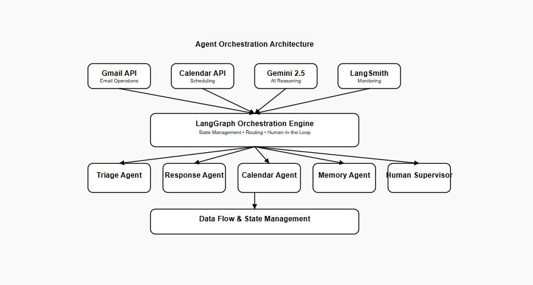
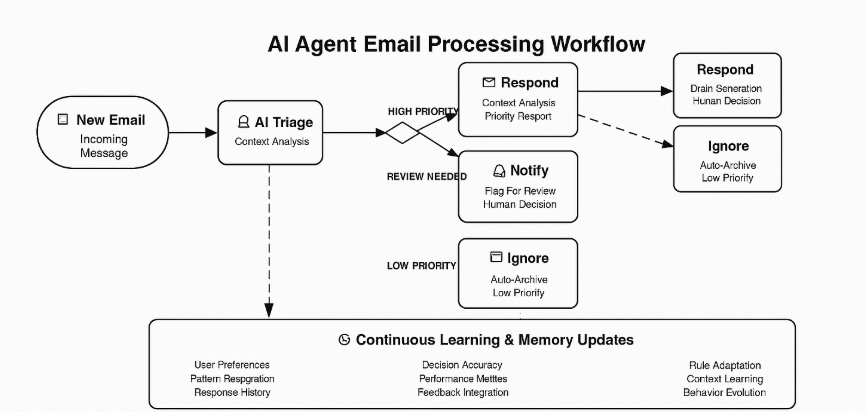

# AI-Powered Gmail Email Assistant

An intelligent email assistant that automatically triages incoming Gmail messages and can draft responses, schedule meetings, and manage your inbox using AI. Built with LangGraph for workflow orchestration and Google's Gemini AI model as the main LLM.

## Agent Orchestration Architecture
<!-- Workflow Diagram -->
<p align="center">
  
</p>

## Technology Stack

### Core AI Framework
- **LangGraph**: Advanced agent workflow orchestration with state management and conditional routing
- **LangChain**: Tool integration and chat model abstraction layer
- **Google Gemini 2.5 Flash**: High-performance language model for reasoning and tool calling

### Agent Infrastructure
- **LangSmith**: Agent performance monitoring, trace analysis, and evaluation framework
- **State Graph Pattern**: Deterministic agent behavior with conditional branching logic
- **Memory Persistence**: Long-term user preference learning and context retention

### Integration APIs
- **Gmail API**: Email reading, sending, and management operations
- **Google Calendar API**: Meeting scheduling and availability checking
- **OAuth 2.0**: Secure authentication and authorization

## LangSmith Integration & Agent Monitoring

The system uses LangSmith for comprehensive agent observability:

### Trace Collection
```python
# Environment configuration for agent tracking
LANGSMITH_API_KEY=your_langsmith_api_key
LANGSMITH_TRACING=true
LANGSMITH_PROJECT=email_assistant_production
LANGSMITH_ENDPOINT=https://api.smith.langchain.com
```

### Agent Performance Metrics
- **Triage Accuracy**: Classification precision across respond/notify/ignore decisions
- **Response Quality**: Human feedback on generated email drafts
- **Tool Execution Success**: API call reliability and error rates
- **Workflow Completion Time**: End-to-end agent processing duration
- **Human Intervention Rate**: Frequency of required manual oversight

### Evaluation Framework
LangSmith enables automated evaluation of agent decisions through:
- Triage classification accuracy assessment
- Response appropriateness scoring
- Tool selection optimization analysis
- Memory update effectiveness tracking

## Advanced Agent Capabilities

### Intelligent Email Triage Agent
Autonomous classification system that analyzes email context, sender relationships, and content urgency to make routing decisions with three primary classifications:
- **respond**: Agent determines response is required and initiates draft generation
- **notify**: Agent flags for human attention with contextual reasoning
- **ignore**: Agent autonomously handles low-priority communications
  
<p align="center">
  
</p>

### AI Response Generation Agent
Context-aware email drafting with personalized writing style adaptation that learns from user feedback and maintains consistent voice across interactions.

### Calendar Intelligence Agent
Autonomous meeting scheduling with conflict detection and availability optimization, integrating with Google Calendar to propose optimal meeting times.

### Human-in-the-Loop Agent Supervision
Strategic human oversight for high-stakes decisions with configurable timeout handling, ensuring critical communications receive appropriate attention.

### Adaptive Memory Agent
Continuous learning system that evolves user preferences through interaction patterns, storing triage rules, response styles, and calendar preferences.

### **Key AI Engineering Patterns:**

- **Agent Personas**: Specialized agents with distinct reasoning capabilities
- **State Graph Orchestration**: Complex workflow management with conditional routing
- **Tool-Calling Architecture**: Structured output parsing with dynamic tool selection
- **Persistent Memory**: Context-aware preference learning across sessions
- **Interrupt-Driven Workflows**: Real-time human collaboration in agent decision loops
- **Production Safety**: Timeout protection, iteration limits, and graceful error recovery
- **Agent Observability**: Comprehensive logging and state tracking for agent behavior analysis

## Prerequisites

- Python 3.13+
- Gmail account with API access
- Google Cloud Project with Gmail and Calendar APIs enabled
- LangGraph deployment running locally or remotely

## Installation

1. Clone the repository:
```bash
git clone <repository-url>
cd email-assistant
```

2. Install dependencies:
```bash
pip install -r requirements.txt
```

3. Set up environment variables:
```bash
cp .example.env .env
```

Edit `.env` with your configuration:
```env
GOOGLE_API_KEY=your_gemini_api_key
GMAIL_TOKEN=your_gmail_oauth_token_json
GMAIL_SECRET=your_gmail_client_secret_json
LANGSMITH_API_KEY=your langsmith api key
LANGSMITH_TRACING=true
LANGSMITH_PROJECT=your project name
LANGSMITH_ENDPOINT=https://api.smith.langchain.com
```

## Setup

### 1. Google Cloud Console Setup

1. Go to [Google Cloud Console](https://console.cloud.google.com/)
2. Create a new project or select existing one
3. Enable the Gmail API and Calendar API
4. Go to "Credentials" → "Create Credentials" → "OAuth 2.0 Client IDs"
5. Choose "Desktop application"
6. Download the client configuration JSON

### 2. Gmail Authentication

1. Save your downloaded OAuth client JSON as `.secrets/secrets.json`
2. Run the authentication setup:
```bash
python tools/gmail/setup_gmail.py
```
3. Complete the OAuth flow in your browser
4. The script will save your access token to `.secrets/token.json`

### **Agent Infrastructure Deployment**

Deploy the LangGraph agent orchestration server:
```bash
langgraph dev
```

The agent management server will be accessible at `http://127.0.0.1:2024` for real-time agent coordination and monitoring.

## Agent Deployment & Execution

### **Activate the Email Agent**

Deploy your autonomous email agent to process incoming messages:

```bash
python tools/gmail/run_ingest.py --email your-email@gmail.com
```

#### **Agent Configuration Parameters**

- `--email` (required): Target Gmail address for agent monitoring
- `--minutes-since`: Agent temporal scope (default: 120 minutes)
- `--graph-name`: Agent deployment identifier (default: "email_assistant_hitl_memory_gmail")
- `--url`: Agent orchestration server URL (default: "http://127.0.0.1:2024")
- `--early`: Single-email agent testing mode
- `--include-read`: Expand agent scope to processed emails
- `--skip-filters`: Disable agent filtering logic

#### **Agent Execution Examples**

```bash
# Deploy agent for recent high-priority emails
python tools/gmail/run_ingest.py --email john@company.com --minutes-since 30

# Single-email agent testing deployment
python tools/gmail/run_ingest.py --email john@company.com --early

# Agent with expanded email scope
python tools/gmail/run_ingest.py --email john@company.com --include-read
```

### **AI Agent Workflow Implementation**

<!-- Workflow Diagram -->
<p align="center">
  
</p>

The main email assistant agent (`email_assistant_hitl_memory_gmail.py`) demonstrates advanced agentic AI patterns:

1. **Autonomous Triage Agent**: Multi-criteria decision making with context understanding
2. **Response Generation Agent**: Dynamic prompt construction with personalization
3. **Calendar Intelligence Agent**: Temporal reasoning and constraint satisfaction
4. **Human Collaboration Agent**: Strategic escalation with timeout management
5. **Memory Management Agent**: Continuous preference learning and adaptation
   
## Technical Implementation

```
email-assistant/                   # Autonomous Email Agent System
├── email_assistant_hitl_memory_gmail.py      # Main agent orchestrator & workflow engine
├── tools/
│   ├── gmail/
│   │   ├── gmail_tools.py         #  Gmail agent tools & API integration
│   │   ├── setup_gmail.py         #  OAuth authentication agent
│   │   ├── run_ingest.py          #  Email ingestion & processing agent
│   │   └── prompt_templates.py   #  Context-aware prompt templates
│   ├── __init__.py                #  Tool registry and agent bindings
│   └── base.py                    #  Base agent tool definitions
├── prompts.py                     #  Dynamic system prompts & agent personas
├── schemas.py                     #  Type-safe agent communication schemas
├── utils.py                       #  Agent utility functions & helpers
├── .secrets/                      #  Secure credential storage (gitignored)
│   ├── secrets.json              #  OAuth client configuration
│   └── token.json                #  Agent access tokens
├── .env                          #  Agent environment configuration
└── requirements.txt              #  AI agent dependencies
```

## Environment Variables

| Variable | Description | Required |
|----------|-------------|----------|
| `GOOGLE_API_KEY` | Gemini API key for AI model | Yes |
| `GMAIL_TOKEN` | Gmail OAuth token JSON | Yes |
| `GMAIL_SECRET` | Gmail client secret JSON | Optional |

## Troubleshooting

### Common Issues

1. **Authentication Errors**
   - Ensure `.secrets/token.json` exists and is valid
   - Re-run `python tools/gmail/setup_gmail.py` if tokens expired

2. **API Quota Exceeded**
   - Check Google Cloud Console for API usage
   - Increase quotas if needed

3. **LangGraph Connection Issues**
   - Verify LangGraph server is running on correct port
   - Check `--url` parameter matches your deployment

4. **Email Not Processing**
   - Check email filters and time range
   - Use `--include-read` to test with read emails
   - Use `--early` flag for single email testing


